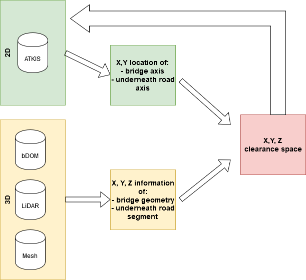
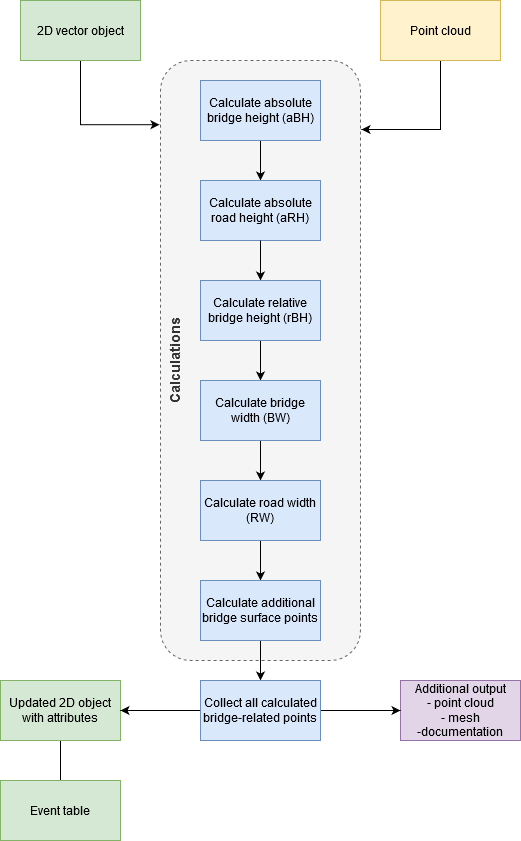
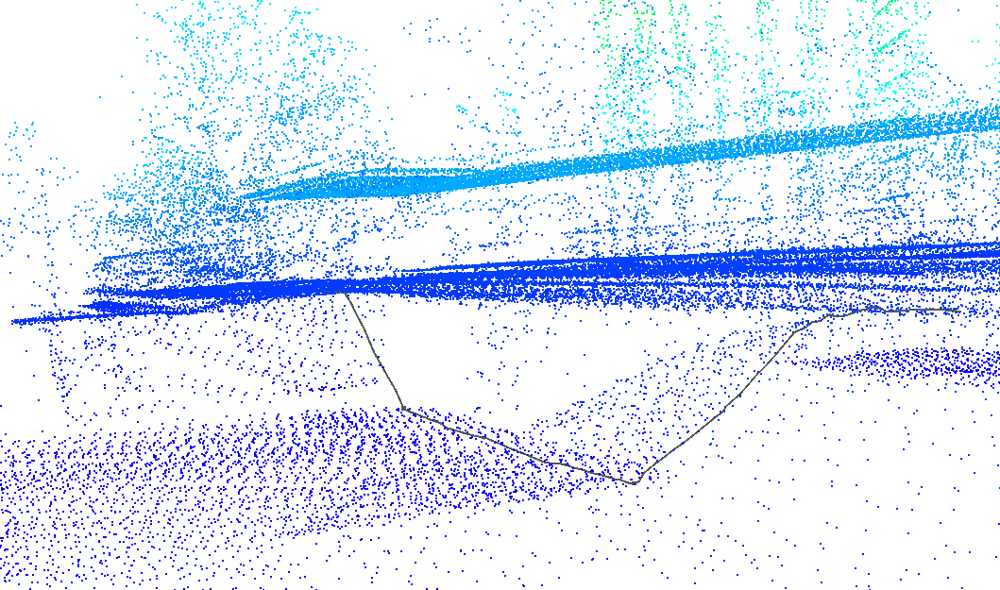
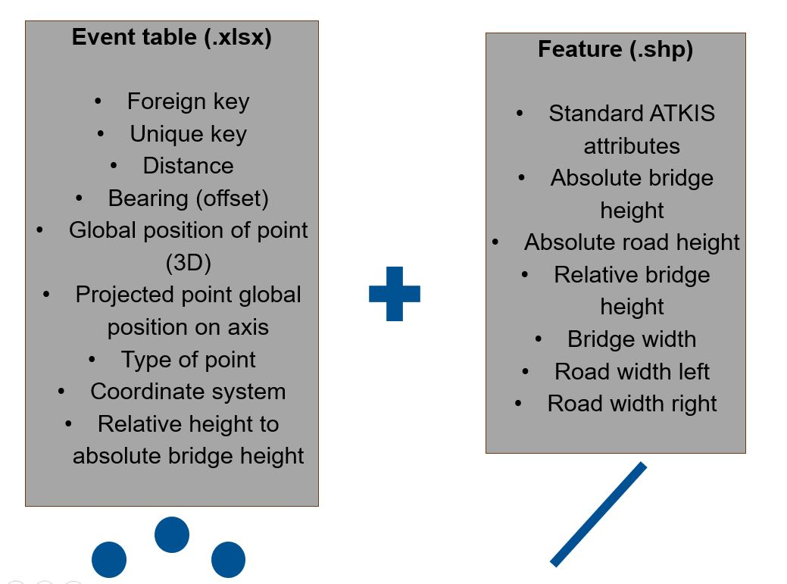
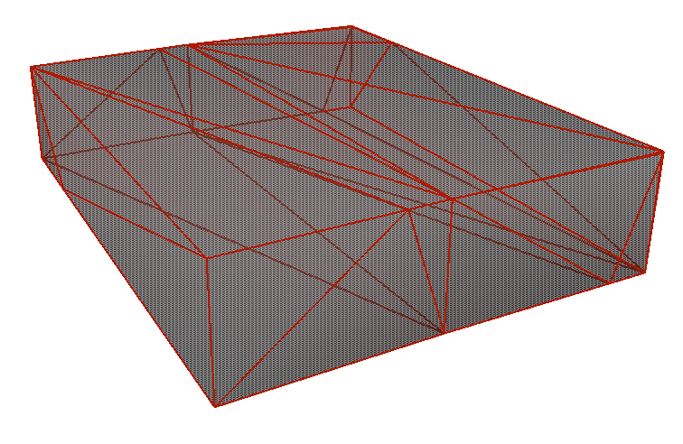

# Clearance Space Detector
The idea of this project is to enrich the two-dimensional ATKIS data with information on the clearance space. To fulfil this task, we use different three-dimensional data like point clouds.
##  :dart: Aim of the project
The main aim of our project was to enrich 2D road objects from ATKIS with information on the clearance space (relevant for underpasses and tunnels) derived from a point cloud.
Within a scope of this project we addressed several research questions:

- Is it possible to describe clearance space of bridges using LiDAR and bDOM data or fusion of those?
- Is it possible to extract relevant point cloud subsets depicting geometry of a bridge automatically using ATKIS data?
- Is it possible to create an automatic workflow to enrich the 2D ATKIS data with clearance space geometrical description?

## :wrench: Data and Tools

 - [ATKIS](http://mobile.adv-online.de/AdV-Produkte/Geotopographie/ATKIS/) (2D, vector)
 - [bDOM](https://geobasis-bb.de/lgb/de/geodaten/3d-produkte/oberflaechenmodell/) (3D, point cloud)
 - [LiDAR](https://en.wikipedia.org/wiki/Lidar) (3D, point cloud)
 - [FME](https://www.safe.com/) (Tool, reproducible workflow)

##   :earth_africa: General outline of the project
The general outline of a project assumed usage of 2D and 3D spatial information in order to asses clearance spaces of bridges and ultimately enrich 2D vector objects with estimated geometries.

## :globe_with_meridians: Detailed workflow of the project
We decided to create our solution for railroad bridges that intersect with the road axis. In ATKIS data there are different subsets representing the railroad axis *(ver03_l)* and road axis *(ver01_l)* as linear objects. Therefore, it was possible to narrow our field of searching for a bridge and intersecting road.

#### To find out step by step how the workflow works refer to the [Project report](./ProjectReport/Clearance_Space_Detector.pdf) :page_facing_up:

## :floppy_disk: Output
The workflow is possible to deliver the following datasets for the bridge clearance space:
- ATKIS enriched shapefile (.shp)
- Event table (.xlsx)
- Point cloud (.xyz, .las, .csv)
- Mesh (.obj)
- Documentation (.docx)

Profile of the bridge

Event table for [Linear Referencing System (LRS)](https://desktop.arcgis.com/en/arcmap/10.3/guide-books/linear-referencing/what-is-linear-referencing.htm)

Visualisation of clearance space using mesh

## :bust_in_silhouette: Authors

 - Gabriel Danzl
 - Olaf Wysocki[ \[LinkedIn\]](https://www.linkedin.com/in/olaf-wysocki-24b557148/);[\[GitHub\]](https://olafwysocki.github.io/)

